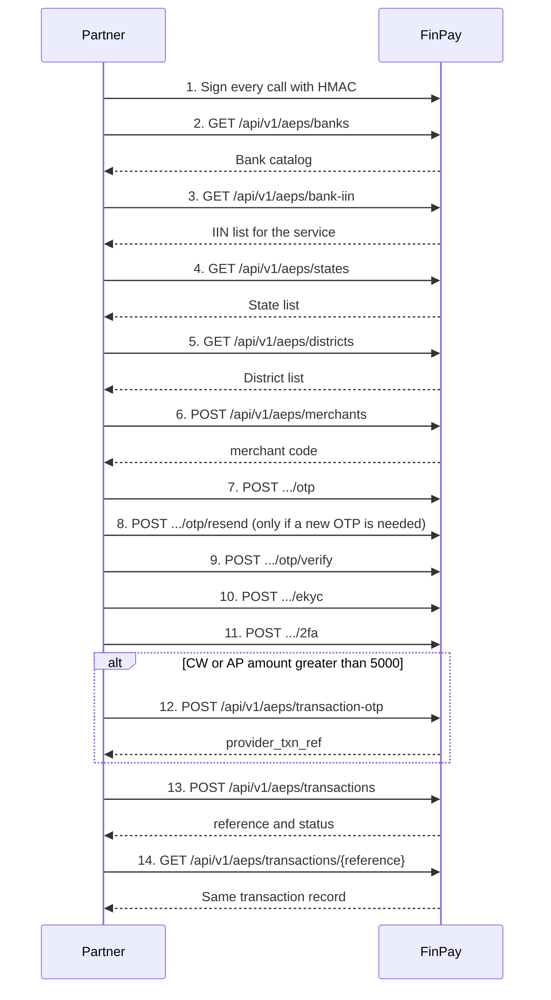

# FinPay AePS API

Client integration guide for the AePS APIs implemented on FinPay.

Base path: `/api/v1`

Every path below is relative to the FinPay API host issued to your company. Send JSON with `Accept: application/json`. POST and other bodies also use `Content-Type: application/json`. The raw body bytes you hash must be the same bytes you send.

This guide describes the current FinPay request and response contract. Catalog list items are returned as received. FinPay does not rename those item fields. Examples use placeholder values. Do not send the placeholders as live customer data.

## Sequence



| Step | Call | Use the result for |
| --- | --- | --- |
| 1 | HMAC authentication | Every later call |
| 2 | Bank catalog | Knowing which banks are available |
| 3 | Bank IIN | `bank_iin` on transaction OTP and sale |
| 4 | States | `state` and `shop_state` on registration |
| 5 | Districts | `district` and `shop_district` on registration |
| 6 | Register merchant | `merchant` code on every later merchant and transaction call |
| 7 | Send OTP | OTP delivery to the merchant |
| 8 | Resend OTP | A replacement OTP, only when required |
| 9 | Verify OTP | Confirm the OTP |
| 10 | eKYC | Biometric merchant KYC |
| 11 | 2FA | Biometric merchant two-factor |
| 12 | Transaction OTP | Only CW or AP above 5000. Save `provider_txn_ref` |
| 13 | Transaction | The AePS sale or enquiry |
| 14 | Transaction lookup | Read that sale again by FinPay `reference` |

Registration must return a merchant that FinPay has registered before OTP, eKYC, 2FA, transaction OTP, or sale. If it has not, those calls return HTTP 422 with `Merchant is not registered with the AePS provider.`

The sale API does not itself check that OTP, eKYC, or 2FA already succeeded. Complete those steps before a live sale. A merchant code can be used only by the partner that registered it.

## Shared rules

### Service codes

| Code | Meaning | Where it is accepted |
| --- | --- | --- |
| `CW` | Cash withdrawal | Bank IIN lookup and sale |
| `BE` | Balance enquiry | Bank IIN lookup and sale |
| `MS` | Mini statement | Bank IIN lookup and sale |
| `CD` | Cash deposit | Bank IIN lookup and sale |
| `AP` | Aadhaar Pay | Bank IIN lookup and sale |
| `CWTFA` | Cash withdrawal transaction OTP | Transaction OTP only |
| `APTFA` | Aadhaar Pay transaction OTP | Transaction OTP only |

Bank IIN `auth_type` accepts only `BA` or `FA`.

### Amount rules

| Service | Amount |
| --- | --- |
| `BE`, `MS` | Must be `0` |
| `CW`, `AP`, `CD` | `100` to `10000`, inclusive |
| `CWTFA`, `APTFA` | Greater than `5000` and at most `10000`. Validation minimum is `5000.01` |

`CW` and `AP` amounts of `5000` or less do not use transaction OTP. Amounts above `5000` must call transaction OTP first.

### Transaction OTP

Call `POST /api/v1/aeps/transaction-otp` only when all of these are true:

- the sale service is `CW` or `AP`
- the amount is greater than `5000`

Use service `CWTFA` before a `CW` sale, and `APTFA` before an `AP` sale. Send the OTP response field `provider_txn_ref` as `cw_auth_txn_id` on the sale. It must belong to a successful OTP (`provider_status_code` `000`) for the same merchant. `BE`, `MS`, and `CD` do not use this call. A `cw_auth_txn_id` sent below the threshold is accepted and forwarded; it is not required.

### client_reference and idempotency

`client_reference` is your identifier, maximum 80 characters.

- Merchant registration: the same `client_reference` for the same partner and the same registration details returns the original merchant and does not register again. HTTP status remains `201`. Different details for that reference return HTTP `409` and `This reference was already used with different merchant details.`
- Sale and transaction OTP: the same `client_reference` for the same partner and the same transaction details returns the original transaction and does not create another one. HTTP status remains `201`. Different details return HTTP `409` and `This reference was already used with different transaction details.`
- OTP send, resend, verify, eKYC, and 2FA still require `client_reference`, but they are not idempotent. Each call is processed again. The merchant response field `client_reference` stays the value stored at registration.

Comparison of a repeated sale includes the merchant, service, amount, bank IIN, Aadhaar, mobile, device, coordinates, transaction OTP reference, and biometric payload. Aadhaar, PAN, account number, and biometric data are not returned.

### Transaction status

`success: true` means FinPay accepted and stored the outcome. Read `data.status` for the transaction result.

| `provider_status_code` | `status` |
| --- | --- |
| `000` | `success` |
| `001` | `failed` |
| `002` | `pending` |
| `003` | `validation_failed` |
| Any other or missing code | `provider_error` |

`initiated` and `processing` exist only while a sale is in flight. A completed HTTP response uses one of the five values above. `failure_reason` is set for `failed` and `validation_failed`.

`wallet_effect` and `charge_effect` are `BUSINESS_RULE_PENDING`. These AePS APIs do not debit a wallet, post a charge, settle, or reverse funds.

### Merchant ownership

`{merchant}` in the URL and `merchant` in a transaction body are the `merchant` code from registration, shaped like `MCH-` plus 10 characters. FinPay resolves it only for the authenticated partner. Another partner's merchant, or an unknown code, returns HTTP `404` and `Merchant not found.` Transaction lookup is the same: only that partner's `reference` is visible.

### Aadhaar in responses

Responses include `aadhaar_masked` only. The form is `X` characters plus the last four digits, for example `XXXXXXXX0738`. Full Aadhaar, PID data, OTP, PAN, and account numbers are not returned.

### HTTP status summary

| HTTP | When |
| --- | --- |
| `200` | Catalog, merchant OTP, resend, verify, eKYC, 2FA, and transaction lookup succeeded at the HTTP layer |
| `201` | Merchant registration, transaction OTP, and sale were stored, including an identical replay |
| `400` | The API secret was sent in the request |
| `401` | HMAC authentication failed |
| `403` | The caller IP is not allowed, or API access is not enabled |
| `404` | Merchant or transaction was not found for this partner |
| `409` | `client_reference` was reused with different details, or the transaction could not be stored |
| `413` | Body larger than 65536 bytes |
| `422` | Validation failed, or a business rule failed |
| `429` | More than 60 requests per minute for the API key, or too many failed authentication attempts |
| `500`, `502` | FinPay could not complete the provider call |

Business-rule and not-found bodies:

```json
{
  "success": false,
  "message": "Merchant not found."
}
```

Validation bodies use HTTP `422` when `Accept: application/json` is set:

```json
{
  "message": "The aadhaar field is required.",
  "errors": {
    "aadhaar": [
      "The aadhaar field is required."
    ]
  }
}
```

Authentication failures:

```json
{
  "success": false,
  "message": "Authentication failed."
}
```

Provider-call failures use `success: false` and `message`. A failed provider call after a sale row is created does not return the transaction object. The stored status becomes `provider_error`.

## 1. Authentication / HMAC

**Purpose.** Prove that the call comes from your company, from an allowed IP, without sending the API secret.

**HTTP method.** Applied to every method in this guide.

**URL.** Every `/api/v1/aeps/...` URL.

**Required headers.**

| Header | Required | Rule |
| --- | --- | --- |
| `X-API-Key` | Yes | Public API key issued by FinPay |
| `X-Timestamp` | Yes | Unix time in seconds. Digits only. Within 300 seconds of FinPay time |
| `X-Nonce` | Yes | 16 to 64 characters. Allowed characters: letters, digits, `.`, `_`, `-`. One use per key inside the 300 second window |
| `X-Signature` | Yes | Lowercase hex HMAC-SHA256 of the canonical string, keyed with the API secret |
| `Accept` | Yes | `application/json` |
| `Content-Type` | Yes for bodies | `application/json` |

Do not send `X-API-Secret`, `secret_key`, or `api_secret`. That request is rejected with HTTP `400` and `Do not send the API secret. Sign the request with HMAC-SHA256 instead.`

The caller IP must match the whitelist on the credential. An empty whitelist is denied. A single IP or a CIDR range is allowed. The partner account must be active and API access must be enabled. Otherwise HTTP `403` and `API access denied.`

Twenty failed authentication attempts from one IP return HTTP `429` and `Too many failed authentication attempts. Try again later.`

**Canonical string.** Five lines, separated by `\n` (LF). No trailing newline.

```text
timestamp
nonce
METHOD
/path?query
sha256_hex(raw_body)
```

- `METHOD` is uppercase.
- Path starts with `/` and includes the query string exactly as sent. Parameter order is part of the signature. No query string means no `?`.
- Hash the raw body. An empty body hashes to `e3b0c44298fc1c149afbf4c8996fb92427ae41e4649b934ca495991b7852b855`.

**Example, not a live credential.**

```text
1711929600
a1b2c3d4e5f67890
GET
/api/v1/aeps/banks
e3b0c44298fc1c149afbf4c8996fb92427ae41e4649b934ca495991b7852b855
```

HMAC-SHA256 with secret `example-secret-do-not-use`:

```text
a7abc0384352ac10271e5ca3e33e1e417e5f944a7d732137b590b68e38ee82b7
```

**Request parameters.** None for authentication itself.

**Success.** Authentication has no body of its own. The next API returns its own success status.

**Error example.**

```json
{
  "success": false,
  "message": "Authentication failed."
}
```

**Next.** `GET /api/v1/aeps/banks`.

## 2. GET /api/v1/aeps/banks

**Purpose.** List banks available for AePS.

**HTTP method.** `GET`

**URL.** `/api/v1/aeps/banks`

**Required headers.** Authentication headers. No body.

**Request parameters.** None.

**JSON request example.** No body. Sign the empty-string hash.

**Success HTTP status.** `200`

**Success JSON example.** `data` is the catalog list. If the result is not a list, `data` is the redacted object.

```json
{
  "success": true,
  "data": []
}
```

**Error example.**

```json
{
  "success": false,
  "message": "Authentication failed."
}
```

**Validation.** No request fields.

**Next.** `GET /api/v1/aeps/bank-iin` with the service you will transact.

## 3. GET /api/v1/aeps/bank-iin

**Purpose.** List bank IIN records for one AePS service and authentication type.

**HTTP method.** `GET`

**URL.** `/api/v1/aeps/bank-iin`

**Required headers.** Authentication headers. No body. Put parameters in the query string and include that exact query string in the signed path.

**Request parameters.**

| Field | In | Type | Required | Validation |
| --- | --- | --- | --- | --- |
| `txn_code` | Query | string | Required | `CW`, `BE`, `MS`, `AP`, or `CD` |
| `auth_type` | Query | string | Required | `BA` or `FA` |

**JSON request example.** There is no JSON body.

```text
GET /api/v1/aeps/bank-iin?txn_code=BE&auth_type=BA
```

**Success HTTP status.** `200`

**Success JSON example.**

```json
{
  "success": true,
  "data": []
}
```

Use the IIN value from a returned record as `bank_iin` later. FinPay does not rename catalog fields.

**Error example.**

```json
{
  "message": "The txn code field is required.",
  "errors": {
    "txn_code": [
      "The txn code field is required."
    ]
  }
}
```

**Next.** `GET /api/v1/aeps/states` when you still need to register a merchant. If the merchant already exists, continue at transaction OTP only when the amount rule requires it, otherwise `POST /api/v1/aeps/transactions`.

## 4. GET /api/v1/aeps/states

**Purpose.** List states for merchant and shop addresses.

**HTTP method.** `GET`

**URL.** `/api/v1/aeps/states`

**Required headers.** Authentication headers. No body.

**Request parameters.** None.

**JSON request example.** No body.

**Success HTTP status.** `200`

**Success JSON example.**

```json
{
  "success": true,
  "data": []
}
```

**Error example.**

```json
{
  "success": false,
  "message": "API access denied."
}
```

**Validation.** No request fields.

**Next.** `GET /api/v1/aeps/districts` with a `state_code` from this list.

## 5. GET /api/v1/aeps/districts

**Purpose.** List districts for one state.

**HTTP method.** `GET`

**URL.** `/api/v1/aeps/districts`

**Required headers.** Authentication headers. No body. Sign the path including the query string.

**Request parameters.**

| Field | In | Type | Required | Validation |
| --- | --- | --- | --- | --- |
| `state_code` | Query | string | Required | Maximum 10 characters |

**JSON request example.** No body.

```text
GET /api/v1/aeps/districts?state_code=24
```

`24` is an example code, not a guaranteed state code. Use a code from the states API.

**Success HTTP status.** `200`

**Success JSON example.**

```json
{
  "success": true,
  "data": []
}
```

**Error example.**

```json
{
  "message": "The state code field is required.",
  "errors": {
    "state_code": [
      "The state code field is required."
    ]
  }
}
```

**Next.** `POST /api/v1/aeps/merchants`.

## 6. POST /api/v1/aeps/merchants

**Purpose.** Register an AePS merchant for the authenticated partner.

**HTTP method.** `POST`

**URL.** `/api/v1/aeps/merchants`

**Required headers.** Authentication headers plus `Content-Type: application/json`.

**Request parameters.**

| Field | Type | Required | Validation |
| --- | --- | --- | --- |
| `client_reference` | string | Required | Maximum 80. Idempotency key for this registration |
| `pipe` | string | Required | Maximum 10 |
| `first_name` | string | Required | Maximum 80 |
| `middle_name` | string | Optional | Maximum 80 |
| `last_name` | string | Required | Maximum 80 |
| `dob` | string | Required | Date `d-m-Y` |
| `email` | string | Required | Email, maximum 120 |
| `phone` | string | Required | Maximum 15 |
| `address1` | string | Required | Maximum 255 |
| `address2` | string | Optional | Maximum 255 |
| `state` | string | Required | Maximum 10. Use a state code |
| `district` | string | Required | Maximum 10. Use a district code |
| `gender` | string | Required | `M`, `F`, or `O` |
| `shop_name` | string | Required | Maximum 120 |
| `mother_name` | string | Required | Maximum 120 |
| `father_name` | string | Required | Maximum 120 |
| `marital_status` | string | Required | `SINGLE` or `MARRIED` |
| `mcc` | string | Required | Maximum 10 |
| `device_ip` | string | Required | IP address |
| `pin_code` | string | Required | Maximum 10 |
| `pan` | string | Required | Maximum 10 |
| `aadhaar` | string | Required | Maximum 16 |
| `shop_pan` | string | Required | Maximum 10 |
| `bank_account` | string | Required | Maximum 30 |
| `bank_ifsc` | string | Required | Maximum 20 |
| `bank_name` | string | Required | Maximum 20 |
| `account_type` | string | Optional | Maximum 40 |
| `shop_address` | string | Required | Maximum 255 |
| `shop_district` | string | Required | Maximum 10 |
| `shop_state` | string | Required | Maximum 10 |
| `shop_pin` | string | Required | Maximum 10 |
| `shop_lat` | string | Required | Maximum 20 |
| `shop_long` | string | Required | Maximum 20 |
| `lat` | string | Required | Maximum 20 |
| `long` | string | Required | Maximum 20 |
| `ip_address` | string | Required | IP address |

**JSON request example.** Identity numbers below are placeholders.

```json
{
  "client_reference": "MERCHANT-1001",
  "pipe": "1",
  "first_name": "Asha",
  "middle_name": "",
  "last_name": "Shah",
  "dob": "01-01-1990",
  "email": "merchant@example.com",
  "phone": "98XXXXXX10",
  "address1": "Shop 1, Example Road",
  "address2": "",
  "state": "24",
  "district": "476",
  "gender": "F",
  "shop_name": "Example Stores",
  "mother_name": "Example Mother",
  "father_name": "Example Father",
  "marital_status": "MARRIED",
  "mcc": "5411",
  "device_ip": "203.0.113.10",
  "pin_code": "380001",
  "pan": "ABCDE1234F",
  "aadhaar": "XXXXXXXX0738",
  "shop_pan": "ABCDE1234F",
  "bank_account": "000000000000",
  "bank_ifsc": "SBIN0000001",
  "bank_name": "Example Bank",
  "account_type": "SAVINGS",
  "shop_address": "Shop 1, Example Road",
  "shop_district": "476",
  "shop_state": "24",
  "shop_pin": "380001",
  "shop_lat": "23.0722",
  "shop_long": "72.6269",
  "lat": "23.0722",
  "long": "72.6269",
  "ip_address": "203.0.113.10"
}
```

On a live call, `aadhaar` is the customer Aadhaar number. The response never echoes it.

**Success HTTP status.** `201`

**Success JSON example.**

```json
{
  "success": true,
  "data": {
    "merchant": "MCH-EXAMPLE01",
    "client_reference": "MERCHANT-1001",
    "onboarding_status": "success",
    "provider_status_code": "000",
    "provider_status_description": "Success",
    "provider_ref": "example-provider-ref",
    "aadhaar_masked": "XXXXXXXX0738",
    "two_fa_at": null
  }
}
```

`onboarding_status` follows the transaction status mapping when a three-digit provider code is present. `two_fa_at` is `null` until 2FA returns `000`. Description and reference strings come from the provider result and may be `null`.

An identical registration replay also returns HTTP `201` and this same object. A provider failure that throws returns `success: false` and can leave `onboarding_status` as `provider_error`. Repeating the same reference then returns that stored merchant and does not register again.

**Error example.**

```json
{
  "success": false,
  "message": "This reference was already used with different merchant details."
}
```

**Next.** `POST /api/v1/aeps/merchants/{merchant}/otp` using `data.merchant`.

## 7. POST /api/v1/aeps/merchants/{merchant}/otp

**Purpose.** Send the merchant onboarding OTP.

**HTTP method.** `POST`

**URL.** `/api/v1/aeps/merchants/{merchant}/otp`

`{merchant}` is the registration `merchant` code. Allowed characters: letters, digits, and `-`.

**Required headers.** Authentication headers plus `Content-Type: application/json`.

**Request parameters.**

| Field | Type | Required | Validation |
| --- | --- | --- | --- |
| `client_reference` | string | Required | Maximum 80 |

**JSON request example.**

```json
{
  "client_reference": "MERCHANT-1001-OTP"
}
```

**Success HTTP status.** `200`

**Success JSON example.** Same object shape as registration. `client_reference` in the response remains the registration reference. `onboarding_status` and `provider_status_code` reflect this OTP call.

```json
{
  "success": true,
  "data": {
    "merchant": "MCH-EXAMPLE01",
    "client_reference": "MERCHANT-1001",
    "onboarding_status": "success",
    "provider_status_code": "000",
    "provider_status_description": "OTP sent",
    "provider_ref": "example-provider-ref",
    "aadhaar_masked": "XXXXXXXX0738",
    "two_fa_at": null
  }
}
```

**Error example.**

```json
{
  "success": false,
  "message": "Merchant not found."
}
```

**Next.** `POST /api/v1/aeps/merchants/{merchant}/otp/verify` after the merchant receives the OTP. If another OTP is required, call resend first.

## 8. POST /api/v1/aeps/merchants/{merchant}/otp/resend

**Purpose.** Send another onboarding OTP.

**HTTP method.** `POST`

**URL.** `/api/v1/aeps/merchants/{merchant}/otp/resend`

**Required headers.** Authentication headers plus `Content-Type: application/json`.

**Request parameters.**

| Field | Type | Required | Validation |
| --- | --- | --- | --- |
| `client_reference` | string | Required | Maximum 80 |

**JSON request example.**

```json
{
  "client_reference": "MERCHANT-1001-OTP-2"
}
```

**Success HTTP status.** `200`

**Success JSON example.** Same merchant object as the send OTP response.

**Error example.**

```json
{
  "success": false,
  "message": "Merchant is not registered with the AePS provider."
}
```

**Next.** `POST /api/v1/aeps/merchants/{merchant}/otp/verify`.

## 9. POST /api/v1/aeps/merchants/{merchant}/otp/verify

**Purpose.** Verify the onboarding OTP.

**HTTP method.** `POST`

**URL.** `/api/v1/aeps/merchants/{merchant}/otp/verify`

**Required headers.** Authentication headers plus `Content-Type: application/json`.

**Request parameters.**

| Field | Type | Required | Validation |
| --- | --- | --- | --- |
| `client_reference` | string | Required | Maximum 80 |
| `otp` | string | Required | Maximum 10. The OTP the merchant received |

**JSON request example.**

```json
{
  "client_reference": "MERCHANT-1001-VERIFY",
  "otp": "000000"
}
```

`000000` is a placeholder. Send the OTP that was delivered. FinPay does not return the OTP.

**Success HTTP status.** `200`

**Success JSON example.** Same merchant object. Treat `provider_status_code` `000` as verified.

**Error example.**

```json
{
  "message": "The otp field is required.",
  "errors": {
    "otp": [
      "The otp field is required."
    ]
  }
}
```

**Next.** `POST /api/v1/aeps/merchants/{merchant}/ekyc`.

## 10. POST /api/v1/aeps/merchants/{merchant}/ekyc

**Purpose.** Submit merchant biometric eKYC.

**HTTP method.** `POST`

**URL.** `/api/v1/aeps/merchants/{merchant}/ekyc`

**Required headers.** Authentication headers plus `Content-Type: application/json`.

**Request parameters.**

| Field | Type | Required | Validation |
| --- | --- | --- | --- |
| `client_reference` | string | Required | Maximum 80 |
| `pid_data` | string | Required | Maximum 20000 characters. Biometric capture payload |

**JSON request example.**

```json
{
  "client_reference": "MERCHANT-1001-EKYC",
  "pid_data": "<PidData>BIOMETRIC_CAPTURE</PidData>"
}
```

Replace `pid_data` with the capture from the biometric device. Do not log it. FinPay does not return it.

**Success HTTP status.** `200`

**Success JSON example.** Same merchant object. `provider_status_code` `000` means eKYC succeeded.

**Error example.**

```json
{
  "message": "The pid data field is required.",
  "errors": {
    "pid_data": [
      "The pid data field is required."
    ]
  }
}
```

**Next.** `POST /api/v1/aeps/merchants/{merchant}/2fa`.

## 11. POST /api/v1/aeps/merchants/{merchant}/2fa

**Purpose.** Complete merchant biometric two-factor authentication.

**HTTP method.** `POST`

**URL.** `/api/v1/aeps/merchants/{merchant}/2fa`

**Required headers.** Authentication headers plus `Content-Type: application/json`.

**Request parameters.**

| Field | Type | Required | Validation |
| --- | --- | --- | --- |
| `client_reference` | string | Required | Maximum 80 |
| `aadhaar` | string | Required | Maximum 16 |
| `device_type` | string | Required | Maximum 40. Biometric device name |
| `pid_data` | string | Required | Maximum 20000 characters |
| `lat` | string | Required | Maximum 20 |
| `long` | string | Required | Maximum 20 |

**JSON request example.**

```json
{
  "client_reference": "MERCHANT-1001-2FA",
  "aadhaar": "XXXXXXXX0738",
  "device_type": "mantra",
  "pid_data": "<PidData>BIOMETRIC_CAPTURE</PidData>",
  "lat": "23.0722",
  "long": "72.6269"
}
```

**Success HTTP status.** `200`

**Success JSON example.** When the provider code is `000`, `two_fa_at` is an ISO-8601 timestamp. FinPay does not expire that timestamp.

```json
{
  "success": true,
  "data": {
    "merchant": "MCH-EXAMPLE01",
    "client_reference": "MERCHANT-1001",
    "onboarding_status": "success",
    "provider_status_code": "000",
    "provider_status_description": "Two FA done",
    "provider_ref": "example-provider-ref",
    "aadhaar_masked": "XXXXXXXX0738",
    "two_fa_at": "2026-10-01T07:30:00+00:00"
  }
}
```

**Error example.**

```json
{
  "success": false,
  "message": "Merchant not found."
}
```

**Next.** For `BE`, `MS`, `CD`, or for `CW`/`AP` of `5000` or less, call `POST /api/v1/aeps/transactions`. For `CW` or `AP` above `5000`, call `POST /api/v1/aeps/transaction-otp` first.

## 12. POST /api/v1/aeps/transaction-otp

**Purpose.** Request the transaction OTP required before a high-value cash withdrawal or Aadhaar Pay.

**HTTP method.** `POST`

**URL.** `/api/v1/aeps/transaction-otp`

**When to call.** Only for a following `CW` sale (`service` `CWTFA`) or `AP` sale (`service` `APTFA`) whose amount is greater than `5000`. Do not call it for `BE`, `MS`, or `CD`.

**Required headers.** Authentication headers plus `Content-Type: application/json`.

**Request parameters.**

| Field | Type | Required | Validation |
| --- | --- | --- | --- |
| `client_reference` | string | Required | Maximum 80. Idempotency key for this OTP transaction |
| `merchant` | string | Required | Maximum 40. Merchant code you own |
| `aadhaar` | string | Required | Maximum 16 |
| `mobile` | string | Required | Maximum 15 |
| `bank_iin` | string | Required | Maximum 10 |
| `lat` | string | Required | Maximum 20 |
| `long` | string | Required | Maximum 20 |
| `ip_address` | string | Required | IP address |
| `service` | string | Required | `CWTFA` or `APTFA` |
| `amount` | number | Required | Greater than `5000` and at most `10000` |
| `app_platform` | string | Required | Maximum 30 |
| `app_version` | string | Required | Maximum 20 |
| `customer_mobile` | string | Optional | Maximum 15 |

**JSON request example.**

```json
{
  "client_reference": "TXN-OTP-1001",
  "merchant": "MCH-EXAMPLE01",
  "aadhaar": "XXXXXXXX0738",
  "mobile": "98XXXXXX10",
  "bank_iin": "000000",
  "lat": "23.0722",
  "long": "72.6269",
  "ip_address": "203.0.113.10",
  "service": "CWTFA",
  "amount": 5001,
  "app_platform": "android",
  "app_version": "1.0.0",
  "customer_mobile": "98XXXXXX10"
}
```

**Success HTTP status.** `201`

**Success JSON example.** Save `provider_txn_ref` when `provider_status_code` is `000`.

```json
{
  "success": true,
  "data": {
    "reference": "AEP-EXAMPLEOTP1",
    "client_reference": "TXN-OTP-1001",
    "merchant": "MCH-EXAMPLE01",
    "service": "CWTFA",
    "amount": 5001,
    "status": "success",
    "provider_status_code": "000",
    "provider_txn_ref": "example-otp-txn-ref",
    "rrn": null,
    "npci_code": null,
    "npci_message": null,
    "provider_status_description": null,
    "provider_available_balance": null,
    "transaction_list": null,
    "aadhaar_masked": "XXXXXXXX0738",
    "bank_iin": "000000",
    "wallet_effect": "BUSINESS_RULE_PENDING",
    "charge_effect": "BUSINESS_RULE_PENDING",
    "failure_reason": null,
    "created_at": "2026-10-01T07:30:00+00:00"
  }
}
```

`transaction_list` is a string when present, otherwise `null`. `amount` is a JSON number.

**Error example.**

```json
{
  "success": false,
  "message": "Transaction OTP type must be CWTFA or APTFA."
}
```

An amount of `5000` or less fails validation (`min:5000.01`) before that business check.

**Next.** `POST /api/v1/aeps/transactions` with `cw_auth_txn_id` set to `provider_txn_ref`, service `CW` or `AP`, and the same merchant.

## 13. POST /api/v1/aeps/transactions

**Purpose.** Run a balance enquiry, mini statement, cash withdrawal, cash deposit, or Aadhaar Pay.

**HTTP method.** `POST`

**URL.** `/api/v1/aeps/transactions`

**Required headers.** Authentication headers plus `Content-Type: application/json`.

**Request parameters.**

| Field | Type | Required | Validation |
| --- | --- | --- | --- |
| `client_reference` | string | Required | Maximum 80. Idempotency key |
| `merchant` | string | Required | Maximum 40. Merchant code you own |
| `aadhaar` | string | Required | Maximum 16 |
| `mobile` | string | Required | Maximum 15 |
| `bank_iin` | string | Required | Maximum 10. From the bank IIN catalog |
| `lat` | string | Required | Maximum 20 |
| `long` | string | Required | Maximum 20 |
| `ip_address` | string | Required | IP address |
| `service` | string | Required | `CW`, `BE`, `MS`, `AP`, or `CD` |
| `amount` | number | Required | `0` to `10000`, then the service amount rule |
| `device_type` | string | Required | Maximum 40 |
| `pid_data` | string | Required | Maximum 20000 characters |
| `cw_auth_txn_id` | string | Conditional | Maximum 120. Required for `CW` and `AP` when amount is greater than `5000` |
| `udf1` | string | Optional | Maximum 100 |
| `udf2` | string | Optional | Maximum 100 |
| `udf3` | string | Optional | Maximum 100 |

Additional business rules after validation:

- `BE` and `MS` amount must be `0`, or HTTP `422` and `Balance enquiry and mini statement amount must be 0.`
- `CW`, `AP`, and `CD` amount must be from `100` to `10000`, or HTTP `422` and `Transaction amount must be between 100 and 10000.`
- `CW` or `AP` above `5000` without `cw_auth_txn_id` returns HTTP `422` and `cw_auth_txn_id is required for CW and AP amounts above 5000. Use the txnRefId returned by the transaction OTP API.`
- A value that is not a successful OTP `provider_txn_ref` for this merchant returns HTTP `422` and `cw_auth_txn_id does not match a successful transaction OTP reference for this merchant.`

The `txnRefId` named in that error is returned to you as `provider_txn_ref`.

**JSON request example, balance enquiry.**

```json
{
  "client_reference": "TXN-BE-1001",
  "merchant": "MCH-EXAMPLE01",
  "aadhaar": "XXXXXXXX0738",
  "mobile": "98XXXXXX10",
  "bank_iin": "000000",
  "lat": "23.0722",
  "long": "72.6269",
  "ip_address": "203.0.113.10",
  "service": "BE",
  "amount": 0,
  "device_type": "mantra",
  "pid_data": "<PidData>BIOMETRIC_CAPTURE</PidData>"
}
```

**JSON request example, cash withdrawal above 5000.**

```json
{
  "client_reference": "TXN-CW-1001",
  "merchant": "MCH-EXAMPLE01",
  "aadhaar": "XXXXXXXX0738",
  "mobile": "98XXXXXX10",
  "bank_iin": "000000",
  "lat": "23.0722",
  "long": "72.6269",
  "ip_address": "203.0.113.10",
  "service": "CW",
  "amount": 5001,
  "device_type": "mantra",
  "pid_data": "<PidData>BIOMETRIC_CAPTURE</PidData>",
  "cw_auth_txn_id": "example-otp-txn-ref"
}
```

**Success HTTP status.** `201`

HTTP `201` with `success: true` is also returned when the stored `status` is `failed`, `pending`, `validation_failed`, or `provider_error`. Read `data.status`.

**Success JSON example.**

```json
{
  "success": true,
  "data": {
    "reference": "AEP-EXAMPLE1234",
    "client_reference": "TXN-BE-1001",
    "merchant": "MCH-EXAMPLE01",
    "service": "BE",
    "amount": 0,
    "status": "success",
    "provider_status_code": "000",
    "provider_txn_ref": "example-txn-ref",
    "rrn": "000000000000",
    "npci_code": null,
    "npci_message": null,
    "provider_status_description": null,
    "provider_available_balance": null,
    "transaction_list": null,
    "aadhaar_masked": "XXXXXXXX0738",
    "bank_iin": "000000",
    "wallet_effect": "BUSINESS_RULE_PENDING",
    "charge_effect": "BUSINESS_RULE_PENDING",
    "failure_reason": null,
    "created_at": "2026-10-01T07:30:00+00:00"
  }
}
```

`reference` is the FinPay id, shaped like `AEP-` plus 12 characters. Use it for lookup. `provider_txn_ref` and `rrn` may be `null` when the provider does not return them. `provider_available_balance` is a string when present.

**Error example.**

```json
{
  "success": false,
  "message": "cw_auth_txn_id is required for CW and AP amounts above 5000. Use the txnRefId returned by the transaction OTP API."
}
```

**Next.** `GET /api/v1/aeps/transactions/{reference}` to read the stored result.

## 14. GET /api/v1/aeps/transactions/{reference}

**Purpose.** Read one AePS transaction for the authenticated partner.

**HTTP method.** `GET`

**URL.** `/api/v1/aeps/transactions/{reference}`

`{reference}` is `data.reference` from the sale or transaction OTP response. Allowed characters: letters, digits, and `-`. This is not `client_reference`.

**Required headers.** Authentication headers. No body.

**Request parameters.** None beyond the URL reference.

**JSON request example.** No body.

```text
GET /api/v1/aeps/transactions/AEP-EXAMPLE1234
```

**Success HTTP status.** `200`

**Success JSON example.** The same transaction object returned when the sale was created, including `status`, `provider_txn_ref`, `rrn`, `aadhaar_masked`, `wallet_effect`, and `charge_effect`.

```json
{
  "success": true,
  "data": {
    "reference": "AEP-EXAMPLE1234",
    "client_reference": "TXN-BE-1001",
    "merchant": "MCH-EXAMPLE01",
    "service": "BE",
    "amount": 0,
    "status": "success",
    "provider_status_code": "000",
    "provider_txn_ref": "example-txn-ref",
    "rrn": "000000000000",
    "npci_code": null,
    "npci_message": null,
    "provider_status_description": null,
    "provider_available_balance": null,
    "transaction_list": null,
    "aadhaar_masked": "XXXXXXXX0738",
    "bank_iin": "000000",
    "wallet_effect": "BUSINESS_RULE_PENDING",
    "charge_effect": "BUSINESS_RULE_PENDING",
    "failure_reason": null,
    "created_at": "2026-10-01T07:30:00+00:00"
  }
}
```

**Error example.**

```json
{
  "success": false,
  "message": "Transaction not found."
}
```

**Validation.** Unknown characters in the reference do not match this route.

**Next.** None. This is a read of a transaction you already created.

## Response fields

### Merchant object

Returned by registration, OTP, resend, verify, eKYC, and 2FA.

| Field | Type | Meaning |
| --- | --- | --- |
| `merchant` | string | FinPay merchant code |
| `client_reference` | string | Reference stored at registration |
| `onboarding_status` | string | Latest mapped onboarding status |
| `provider_status_code` | string or null | Three-digit provider code when present |
| `provider_status_description` | string or null | Provider description of this call |
| `provider_ref` | string or null | Provider reference when present |
| `aadhaar_masked` | string or null | Masked Aadhaar |
| `two_fa_at` | string or null | ISO-8601 time after 2FA code `000` |

### Transaction object

Returned by transaction OTP, sale, and lookup.

| Field | Type | Meaning |
| --- | --- | --- |
| `reference` | string | FinPay transaction id |
| `client_reference` | string | Your idempotency key |
| `merchant` | string or null | Merchant code |
| `service` | string | Service code stored for the call |
| `amount` | number | Amount |
| `status` | string | FinPay status |
| `provider_status_code` | string or null | Provider code |
| `provider_txn_ref` | string or null | Provider transaction reference. This is the OTP value to send as `cw_auth_txn_id` |
| `rrn` | string or null | RRN when returned |
| `npci_code` | string or null | NPCI code when returned |
| `npci_message` | string or null | NPCI message when returned |
| `provider_status_description` | string or null | Provider description |
| `provider_available_balance` | string or null | Balance string when returned |
| `transaction_list` | string or null | Mini-statement text when returned |
| `aadhaar_masked` | string or null | Masked Aadhaar |
| `bank_iin` | string or null | Bank IIN sent on the call |
| `wallet_effect` | string | `BUSINESS_RULE_PENDING` |
| `charge_effect` | string | `BUSINESS_RULE_PENDING` |
| `failure_reason` | string or null | Set for failed and validation-failed outcomes |
| `created_at` | string or null | ISO-8601 creation time |
